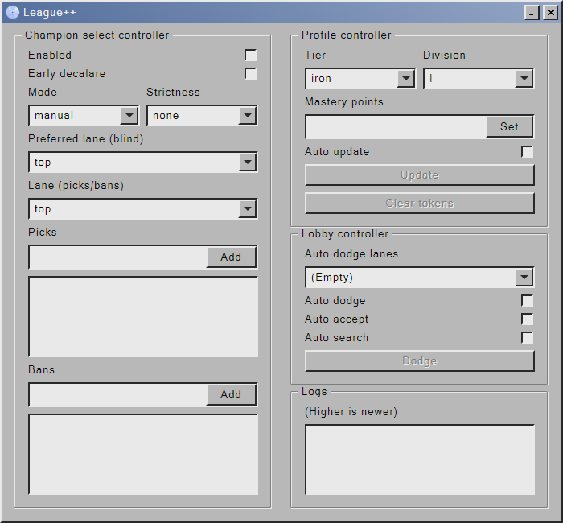

## League++
A league client written in c++



## features

### Champion select controller
* Auto pick & ban champs

### Profile controller
* Set rank
* Set mastery
* Clear tokens

### Lobby controller
* Auto accept match
* Dodge match
* Auto dodge when on unwanted lane

<!--
## building
* CMake

### how to build
1. first build the rust project
```bash
# (powershell)
$ cd src/chatproxy
$ cargo build; cargo build --release
```

2. build the C++ project using CMake.
-->